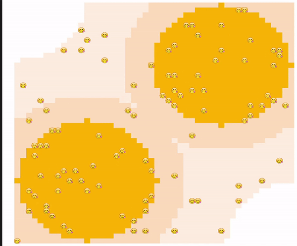
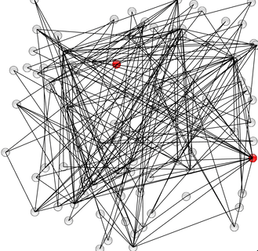

# krABMaga examples

This repository hosts working examples of agent-based simulations, based on the krABMaga framework for the simulation engine and the visualization framework.

#  Table of contents

| Model                                       | Simulation         | Visualization                             |
| --------------------------------------------| ------------------ | ----------------------------------------- |
| [Ants Foraging](antsforaging)               | :heavy_check_mark: |       | 
| [Flockers](flockers)                        | :heavy_check_mark: |          |
| [ForestFire](forestfire)                    | :heavy_check_mark: |    |
| [ForestFire_bayesian](forestfire_bayesian)  | :heavy_check_mark: | 
| [Schelling](schelling)                      | :heavy_check_mark: |     |
| [Sir_bayesian](sir_bayesian)                  | :heavy_check_mark: |
| [Sir_ga_exploration](sir_ga_exploration)               | :heavy_check_mark: |
| [Sugarscape](sugarscape)                        | :heavy_check_mark: |      |
| [Template](template)                        | :heavy_check_mark: |      |
| [Virus on a Network](virusnetwork)          | :heavy_check_mark: |      |
| [Wolf Sheep Grass](wolfsheepgrass)          | :heavy_check_mark: |   |
