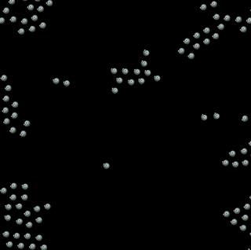

# Rust Flockers

---

A simple implementation of the Flockers simulation, both with and without UI, fully based on the RustAB framework. There
are currently two versions:

- The simulation without the visualization framework. Outputs the time elapsed for given a number of steps and number of
  agents (currently hardcoded), along with the step for seconds.
- The simulation with the visualization framework enabled (either natively or compiled to WebAssembly). Shows a
  graphical interface describing the flockers moving in the environment, casually grouping together and avoiding other
  flockers. The simulation never stops.

---

---

# How to run

---

- To run only the simulation, run `cargo run --release`.
- To run the native visualization, run `cargo make run --profile release`.
- To serve the web visualization locally, run `cargo make serve --profile release`.
