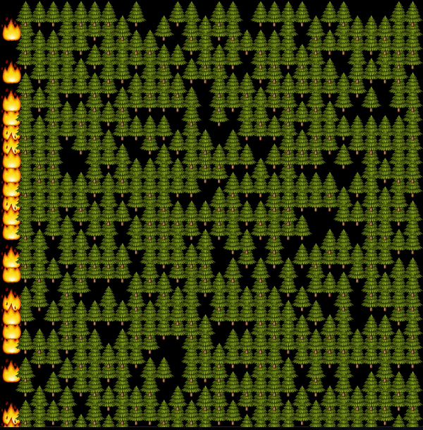

# krABMaga Forest Fire

It is a stochastic model to simulate the spread of a fire through a forest. Apart the dimensions of the field, the model has only one parameter: forest density.

Each tree can have one of three states:
- `Green`: the tree is alive and can burn.
- `Burning`: the tree is burning and can burn nearby trees .
- `Burned`: After a step as `Burning`, the tree is burned and can't burn anymore.

At the start, for each cell, there is a probability of `forest_density` that a tree will be `Green`. Each tree inside the first column is set to `Burning` to start fire spreading.

---

---

# How to run

- To run only the simulation, run `cargo run --release`.
- To run the native visualization, run `cargo make run --profile release`.
- To serve the web visualization locally, run `cargo make serve --profile release`.
