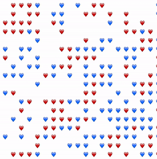

# Schelling model

Created by the economist Thomas Schelling, this model shows how individual tendencies regarding neighbors can lead to segregation. That's the reason why is also called `Segregation Model`.

There are two types of agents, `Red` and `Blue`. Red agents want to live near other Reds, and other way round. In each step, an unhappy agent will try to find a new home, moving to an empty position. An agent is happy if he has 3 similar agents as neighbors.

---

---

# How to run

- To run only the simulation, run `cargo run --release`.
- To run the native visualization, run `cargo make run --profile release`.
- To serve the web visualization locally, run `cargo make serve --profile release`.
